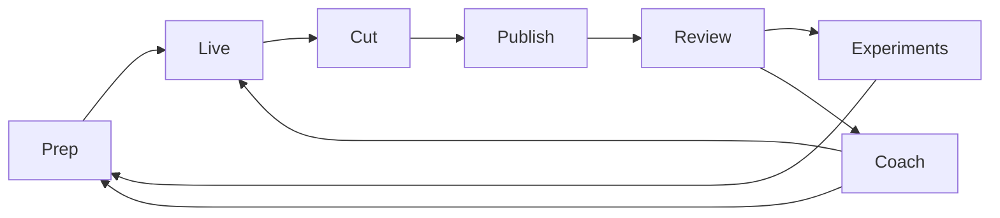

# YAP: from the first pass to the full vision

YAP's aim is to help people communicate and grow through purposeful experimentation: what you learn from one recording or conversation should inform the next. Video creation is the first product path. Loom-style messages, meetings, presentations, interviews and difficult conversations belong to the broader vision.

**Status: first-pass local prototype, 5 October 2026.** The current source gives reviewers a foundation they can run and inspect. The roadmap describes work ahead and how to judge it. It does not claim that every module, a trained personal model or improved real-world outcomes already exists. See [the current build](README.md#what-to-assess) and [the claim ledger](docs/CLAIMS.md).

## Seven modules, one connected experience

The existing modular plan groups **Prep, Live, Cut and Coach** under creating; **Publish** under getting the work out; and **Review and Experiments** under learning from it.

| Module | Role in the finished product | Foundation in this snapshot | Next work and acceptance evidence |
| --- | --- | --- | --- |
| **Prep** | Coach a rough thought into a story, select a suitable format and prepare editable beats while preserving the person's voice. | Saved ideas, editable beats, rehearsal and optional model conversation. | Finish voice Riff and format-specific structures; bring a reviewed experiment into the next idea. An outside user must be able to follow their own idea through to the take, inspect suggestions and reject them without losing their words. |
| **Live** | A context-aware beat prompter, with corrections and retakes during recording. | Camera/microphone capture, beat controls, typed/held-key interaction, optional conversation and presentation capture. | Make hands-free wake and beat following reliable across real microphones, accents and interruptions. Measure missed/false activations and response time; preserve and recover the recording when speech or a model fails. Natural wake is currently experimental. |
| **Cut** | Produce an editable first cut using the context of the recording, with reversible retakes/fillers, captions and relevant B-roll. | Reviewable cuts, trim, original retained, MP4 export, transcript/caption controls and local B-roll. | Validate difficult media, long takes, interruptions and every cut boundary; improve selection of takes and B-roll. Add stock/generated media only through real integrations, then audio cleanup and Premiere/Resolve interchange. Playback and export must agree, and the original must remain recoverable. |
| **Coach** | Give one useful, chosen cue at the right moment, informed by the person's goals and prior sessions. | Editable cues and rehearsal; pacing-related engine components. | Connect reliable pace and camera signals to live guidance. Face-based smile sensing is not implemented in this snapshot. Test whether cues help, distract or misfire; let users turn them off. A camera signal must not be presented as proof of someone's emotion or confidence. |
| **Publish** | Deliver approved content to connected destinations without losing the recording's context. | Export and manual upload path. | Add channel authentication, publishing and publish-status verification. Prove each destination independently, including revoked access, retries and duplicate prevention. A publishing bridge is a candidate dependency until tested; manual export remains useful if approvals are delayed. |
| **Review** | Show what actually happened, connect outcomes to specific moments and carry an accepted lesson forward. | Labelled sample analytics; local own-video transcript/notes and optional text-grounded assistance; saved cues. | Import authorised real analytics with source, date and video identity. Distinguish observations from explanations. Demonstrate that a lesson the user accepts reaches the next idea and take and can be edited or removed. Sample graphs are not connected platform data. |
| **Experiments** | Co-design a change, state a prediction before trying it, compare the outcome and update the next recommendation. | Explicit saved trials, counts and keep/revert decisions; prepared examples. | Connect trials to real outcomes and comparable baselines. Record the hypothesis, intervention, metric and observation window before the result. Include failed and inconclusive trials; do not turn a correlation into a causal improvement claim. |

## Shared learning layer

The full vision needs more than seven screens. These are proposed shared components, not completed services in this repository:

| Component | What gets built | How it earns a stronger claim |
| --- | --- | --- |
| **Shared records** | Stable IDs linking a goal, idea, beats, takes, cut, published item, experiment and outcome; versioned changes and source references. | Trace a recommendation back to the relevant input and result. Prevent one person's or one video's records from being mixed with another's. |
| **Communication ontology and format library** | A structured vocabulary for goals, audience, format, story, delivery choices and outcome measures. | Test consistent labels and whether retrieval improves recommendations. Version it; keep human corrections. A growing taxonomy alone does not establish a moat. |
| **Personal strategy and memory** | User-editable preferences, goals, accepted/rejected advice and past experiments. Begin with retrieval and explicit memory; evaluate trained adapters or other personal models when data supports them. | Compare against the same system without personalisation on held-out sessions. Measure useful recommendations, voice fidelity and actual outcomes. Saved preferences are not trained model weights. |
| **Learning across users** | An opt-in route for permitted, minimised data to improve shared recommendations or models, with clear usage rights, retention and deletion controls. | Isolate users, test for leakage, evaluate held-out people and tasks, and document whether more data actually improves quality. Aggregation alone is not proof of anonymity or defensibility. |
| **Evaluation and model routing** | Versioned tasks, prompts, model configurations, results, cost and latency; compare base models, contextual retrieval, personalisation and any tuning. | Keep a holdout set and report losses as well as wins. Promote a new model only after it improves the chosen task without unacceptable regressions. |

Dependencies matter: an experiment's prediction comes **before** publication; Review needs the resulting analytics; personalised learning needs linked, permissioned history; training needs sufficient suitable data; superiority claims need evaluation. These steps cannot be replaced by a persuasive demo.

## Original four-week plan

This is the calendar shown for the entry: **5 October–1 November 2026**, with Sunday checks. It is a plan, not a completion report or guarantee. A later proposal used a different calendar; it is not substituted here. Connector approvals and external-user participation remain dependencies.

| Week / target check | Modules and work | Planned acceptance check |
| --- | --- | --- |
| **1 · 5–11 Oct; Sunday 11 Oct** | **Live + Cut:** wake phrase/countdown, reversible editing, captions and local B-roll; check publishing feasibility early. | Try the wake phrase 10 times and 10 ordinary uses of “yap”: the original target is at least 9 intended activations and no false activations in that small check. An unfamiliar reviewer restores a cut and exports with captions and one B-roll clip. |
| **2 · 12–18 Oct; Sunday 18 Oct** | **Prep + Coach + Publish:** voice Riff, pace/smile cues and YouTube/Instagram publishing. | Talk an idea into editable beats without typing; trigger the selected pace and smile cues; publish a YAP video to the connected destinations without leaving the app. Each destination must be verified separately. |
| **3 · 19–25 Oct; Sunday 25 Oct** | **Review + Experiments:** real platform results and predictions recorded before publication. | Review shows sourced results for the Week 2 video. Compare its pre-recorded prediction with the outcome; an accepted lesson opens the next take. This checks the learning loop, not a proven performance improvement. |
| **4 · 26 Oct–1 Nov; Sunday 1 Nov** | **Whole product:** installation, integration and outside-user use. | Five people outside the build each make and post a video. Include a beginner installing on a clean Mac without help. Log completion, time, failures and help required. |

The wake check is a small acceptance sample, not a statistically reliable accuracy estimate; broader testing must include varied voices, microphones and background speech. A smile cue firing does not prove accurate sensing or useful coaching. The five-user gate demonstrates early usability only. Actual improvement and model advantage need the separate evaluations below. Manual upload can keep the loop usable if a connector is delayed, but does not pass the in-app publishing gate.

## Evidence needed beyond the calendar

The following checkpoints explain how the full claims become supportable. They supplement the original schedule; they do not announce a new approved delivery plan or staffing commitment. Integrate one real-video journey early so separate module demos do not conceal broken handoffs.

| Milestone | Deliverable | Exit check |
| --- | --- | --- |
| **1. Establish the first pass** | One named source tree, reproducible setup, claim/status inventory and recorded baseline walkthrough. | Someone outside the build installs the exact package, records a short real take, makes/restores a cut and plays the export. Record failures and remaining gaps. The current selected tests are a starting point. |
| **2. Complete a thin real loop** | Own idea → preparation → recording → cut → published video → real outcomes → accepted lesson → next take. | Walk one actual video through every transition. Manual upload and an attributed analytics import are acceptable temporary bridges; identify them explicitly. |
| **3. Improve the seven modules** | Reliable voice interaction, richer Prep/Cut/Coach, verified publishing connectors and usable real-data Review. | Parallel work meets shared interfaces and merges into the same product. An independent reviewer repeats the whole journey after each integration; separate checks cover recording safety, wake reliability, model failure, media export and each connector. |
| **4. Demonstrate useful learning** | Linked experiments, personal history and recommendations that respond to results. | A later video uses a lesson from an earlier one. Compare outcomes against a specified baseline across enough users/sessions to assess uncertainty. Report cases where advice does not help. One saved cue proves continuity, not uplift. |
| **5. Evaluate the model advantage** | Task-specific retrieval/tuning and, where justified, personal/shared models. | Run the benchmark described in the claim ledger against named base models with comparable context, tools and resources. Publish the method, distributions, limitations and reproducible results. No general frontier-superiority claim from a narrow win. |
| **6. Expand beyond content** | Loom-style sharing, meeting workflows, presentation/interview practice and optional conversation rehearsal; later desktop, clipping and goal-game features. | Validate each new workflow separately with intended users. Add participant consent, access and deletion controls for meetings. Measure communication outcomes appropriate to the context; do not assume social-media improvements transfer to private conversations. |

Other announced work includes audio cleanup, the “Don't Judge” concept, long-video-to-shorts clipping and a goal-based progress/game path. These need scoped designs and their own acceptance checks; they are not completed features of this snapshot. The original roadmap places clipping, meetings/life, the goal game and a desktop app after the four-week plan.

A release gate combines functional checks, a recorded walk of the packaged app by someone who did not build it, outside-user use and Deth's judgment of the experience. If a module fails, show its actual status and keep the usable path available. The original plan proposed booking a shortlisted freelancer the next day after a missed module gate. That is the proposed contingency, not evidence that a shortlist, booking or spending approval exists, or a guarantee of recovery.

## How the build stays modular

Each module gets a small contract: inputs, outputs, state ownership, privacy boundaries, failure behaviour and acceptance examples. UI and model work can proceed in parallel behind those contracts, with one integration owner. Tests cover components; the full journey catches failures between them.

Existing open-source components remain credited in [NOTICE](NOTICE). Future integrations must be assessed for suitability, maintenance, licensing and actual end-to-end behaviour before they are called supported. This plan does not assume a connector works merely because an API or a similar project exists.

## Basis of this roadmap

This is a public-facing synthesis of the original seven-module/four-week plan, the [Loom function map](docs/LOOM_MAP.md), the source snapshot described in the README, and Deth's 5 October clarification about the broader communication vision. The additional evaluation and integration checks above are proposed engineering checks. Neither later staffing proposals nor a different calendar are adopted as commitments.

The roadmap describes how the claims can become testable. [CLAIMS.md](docs/CLAIMS.md) states what would justify saying they have been achieved.
